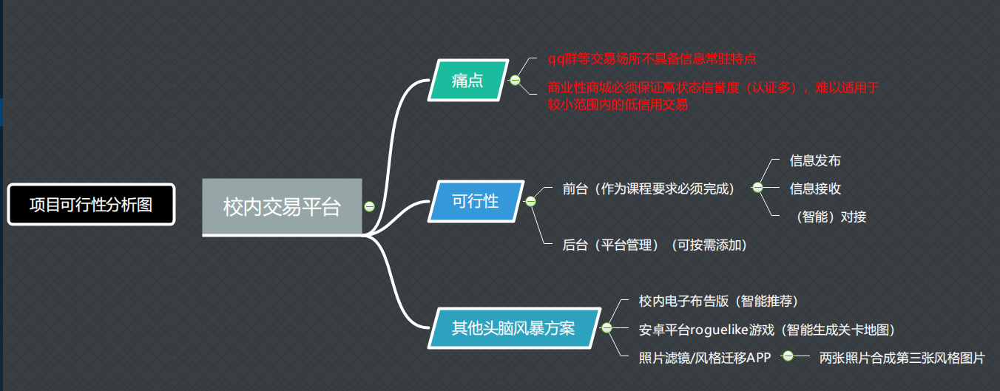
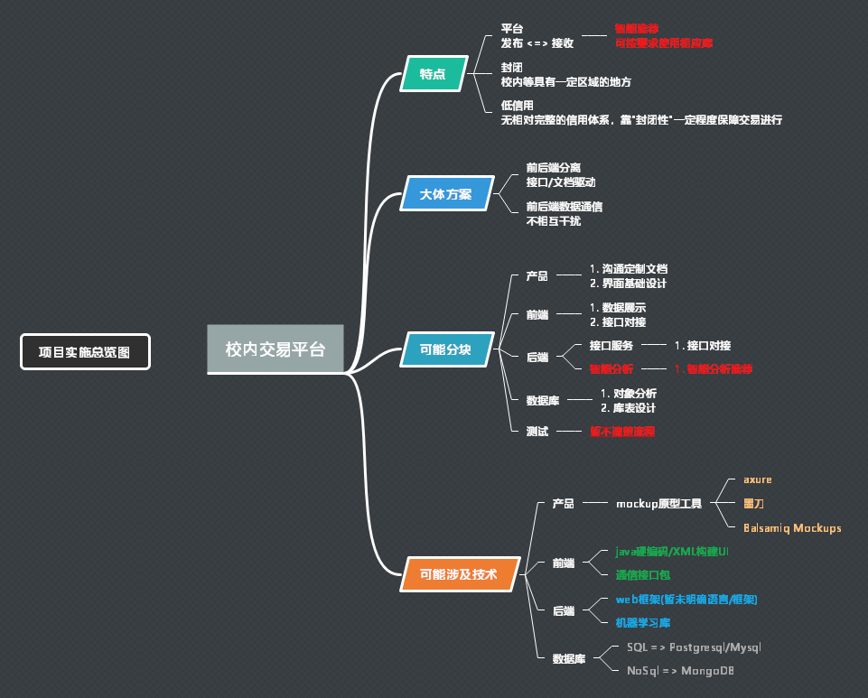
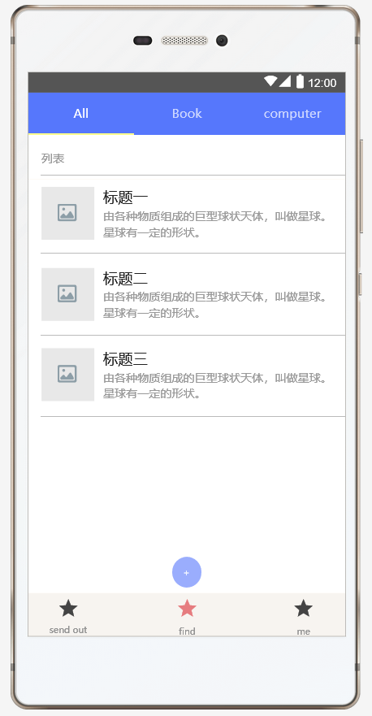

# Sustech keke

**_Name: 周恒(Alan Chou)_**

**_Email: alanzhchou@gmail.com_**

## Part-1 Analysis
> Available



> Basic 




## Part-2 prototype
>  1. requirements [beta]
```
1. [find help] send out your requirements
2. [i can help] get other requirements(or mark that i can support some help)
3. [platform] matching requirements
```

> 2. function [beta]
```
1. register and login => session management
2. send out requirement => send out requirement
3. update requirement list => get requirement and local update
```

> 3. User Interface [beta]



[interface design demo](file:///I:/%E8%AF%BE%E7%A8%8B/%E8%AF%BE%E4%BB%B6/%E5%A4%A7%E5%9B%9B%E4%B8%8B%E8%AF%BE%E4%BB%B6/%E8%BD%AF%E4%BB%B6%E5%B7%A5%E7%A8%8B/project/design/offical/prototype/index.html)

## Part-3 DBA atom
1. only the client side
> 1. user => ~1000-10000

> 2. Post Object => ~1000-5000/day

> 3. comments

> 4. Post Object types

> 5. Post Object tags

> 6. transaction table

> 7. *favorite Post table (work for AI algorithm)

> 8. *System config 
```
when face more users or infomation => module to many smaller parts
```
[details about DBA design]()


## Part-4 user story tips
> 1. how to check a transcation is over? 
```
1. the reputation system :: once a transcation is over 
=> the poster choose/check the accepter in the comments list(!!!)
=> send comfirm information to accepter 
=> accepter check the transcation 
=> both check => transcation is over

<>key point => higner reputation => more like show in index page 

if one transcation is not over almong a long time( two weeks )
hide it from where the user can see it(destory or not)
```

> 2. how to avoid bad behavior user(cheater)?
```
1. report him/her to the system :: once a cheater do a bad behavior
=> report to system
=> check in 
=> cancel Auth => reduce to 0 reputation => can not post in recent days
=> not solved in several days(two weeks) => move to blacklist(!!!) 
=> solved => reduce nonzero reputation 

<>key point => blacklist => creat blacklist notice to let others know
```

> 3. how to avoid too much post for bad user?
```
1. make the big post number/day relate to the reputation 
=> limited post for one person/day

<>key point => higher reputation => higher post number/day
```

